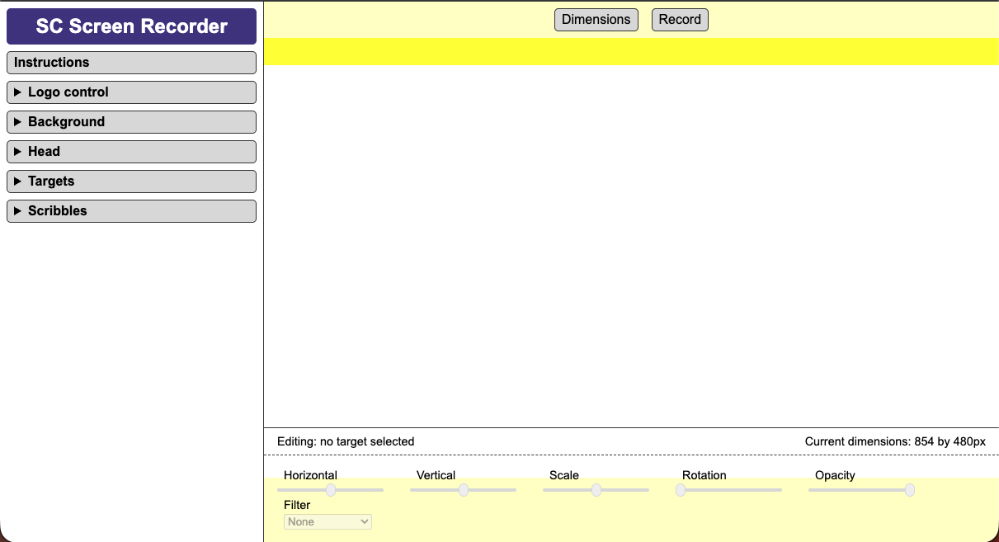
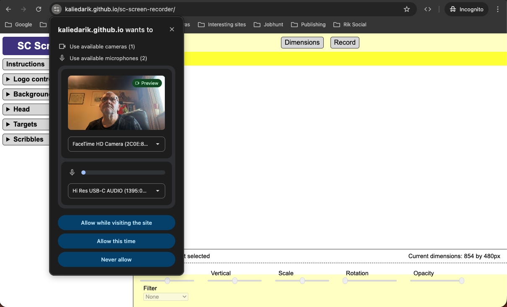
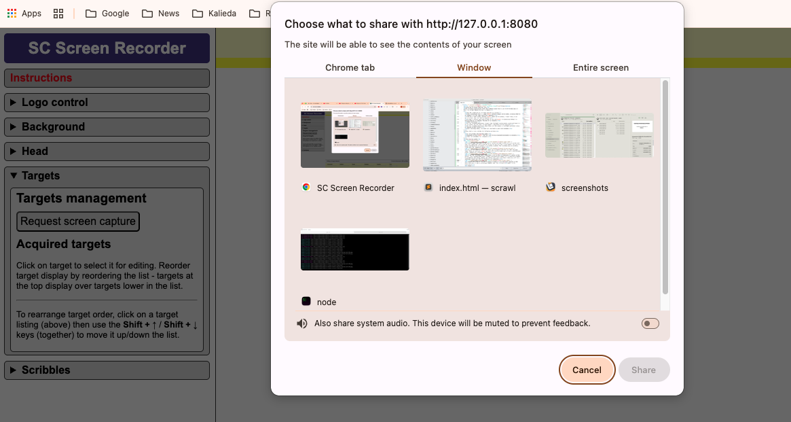
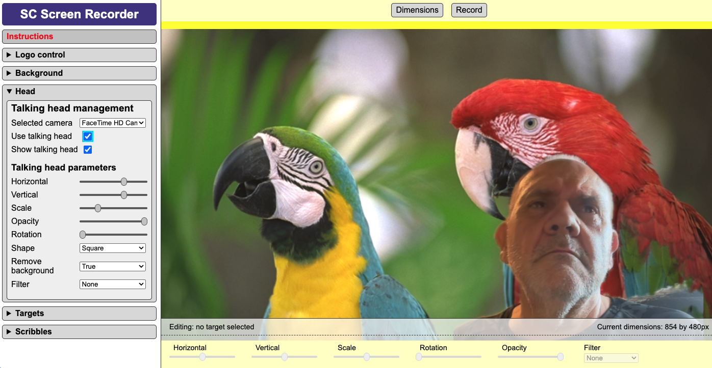
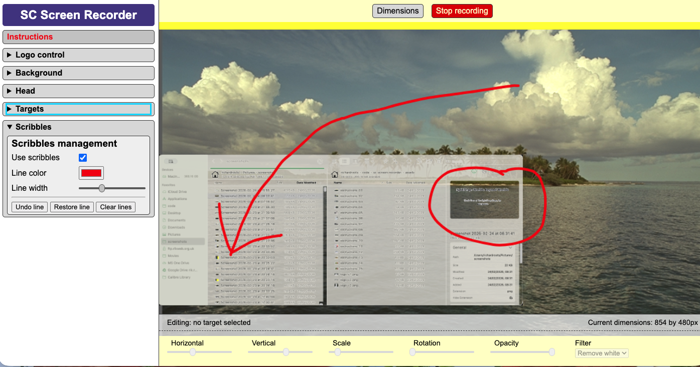
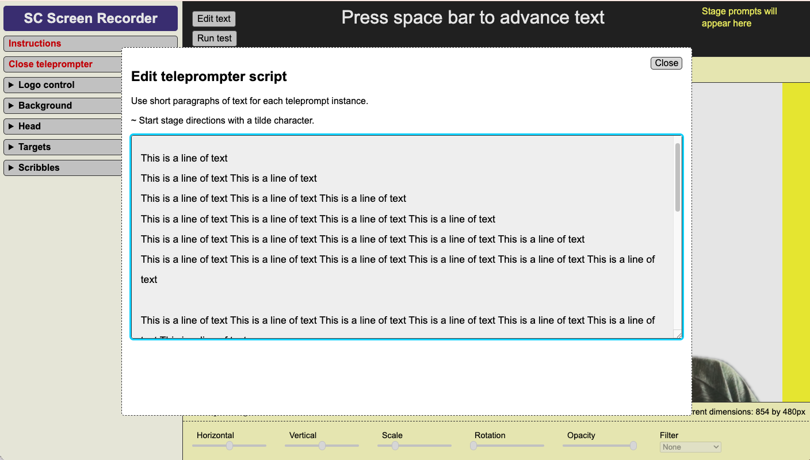

# Scrawl-canvas screen recorder

A browser-native screen recording and explanation studio.
- capture multiple screen regions  
- compose them on a canvas  
- annotate while recording  
- narrate with camera + teleprompter  

Runs entirely in the browser. No installs. No accounts. No uploads.

<table>
<tr>
<td width="33%">
<br>
<sub>Application interface on initial page load</sub>
</td>
<td width="33%">
<br>
<sub>Camera and microphone permissions</sub>
</td>
<td width="33%">
<br>
<sub>Capture browser tabs, windows and screens using the browser's native functionality</sub>
</td>
</tr>

<tr>
<td width="33%">
<br>
<sub>Talking head overlay with background removal</sub>
</td>
<td width="33%">
<br>
<sub>Live annotation while recording</sub>
</td>
<td width="33%">
<br>
<sub>Teleprompter - quick editing, testing and use</sub>
</td>
</tr>
</table>

**Try it now:** https://kaliedarik.github.io/sc-screen-recorder/

## Key Features

### Multi-Target Screen Capture
Capture multiple windows, browser tabs, or entire screens simultaneously and arrange them on a canvas. Each target can be moved, scaled, rotated and layered to highlight the parts of the screen you want viewers to focus on.

### Canvas Composition
Targets behave like visual objects on a canvas. They can be repositioned, reordered and adjusted while recording, allowing you to construct a clear visual explanation of what is happening on screen.

### Talking Head Overlay
Include a camera feed alongside the captured screen. The tool can remove the background behind the speaker using Google's **MediaPipe segmentation model**, creating a simple picture‑in‑picture effect without needing a green screen.

### Teleprompter
A built‑in teleprompter allows scripted narration while recording. The teleprompter supports:
- reading text prompts
- stage directions
- comment lines for notes or metadata
- keyboard advancement during recording

### Live Annotations (Scribbles)
Draw directly onto the canvas while recording to highlight UI elements or draw attention to specific parts of the screen. Line colour and width can be adjusted, and lines can be undone, restored or cleared.

### Custom Backgrounds
The recording canvas can use a solid colour or an uploaded image background. This makes it easy to obscure sensitive content or create a consistent visual presentation.

### Logos and Branding
Optional logos can be placed on the canvas and positioned in any corner of the video frame.

### Flexible Video Formats
Recordings can be created in several common aspect ratios. Each format supports multiple resolutions:
- Landscape (16:9)
- Square (1:1)
- Portrait (9:16)

### Microphone Support
Select a microphone for narration and monitor its input level in real time before recording.

### Local Recording & Download
When recording stops, the video file is generated and downloaded directly to the user's machine. No upload step is required.

## Primary Use Cases

### Quick Reaction Videos
The tool is well suited to creating fast reaction or commentary videos — particularly for journalists, analysts and independent creators. A typical workflow might involve:
- capturing a news article or social media post
- highlighting sections with live annotations
- narrating commentary with a talking-head overlay
- using the teleprompter for prepared notes

Because everything runs locally in the browser, a complete video can be recorded and downloaded within minutes.

### Explaining Problems Visually
When something goes wrong — in software, documentation or a workflow — it is often easier to **show the issue** than to describe it. The recorder allows you to:
- capture multiple windows or tabs
- annotate the screen while explaining
- narrate the problem using a microphone
- optionally include a camera feed

The resulting video can be shared with developers, colleagues or support teams and often communicates the issue far more clearly than written descriptions.

### Short Explainer Videos
The canvas composition model makes it easy to create quick explainer videos for:
- feature walkthroughs
- onboarding guides
- documentation updates
- design discussions

Multiple screen regions can be arranged and narrated like a miniature presentation.

### Other Possible Uses

- User testing sessions
- Technical support demonstrations
- Code review walkthroughs
- Student presentations
- Async collaboration updates

## Privacy by Design

This tool uses standard browser media APIs. Everything happens inside the browser:
- No data is uploaded anywhere
- No accounts are required
- No analytics or tracking scripts
- Videos are saved locally

## Files Generated by a Recording

If the teleprompter is **not used**, the tool downloads a single video file - for example:

```
SC-screen-recording_2026-03-16_14-22-31.webm
```

If the teleprompter **is used during recording**, the tool downloads a ZIP archive containing several related files:

```
SC-screen-recording_TIMESTAMP.zip
```

Inside the archive you will find a range of files for easier video project replication and subtitling. These additional files make it easier to:
- upload captions when posting to social media
- edit the video later in external software
- archive the script alongside the video
- reuse the teleprompter script for future recordings

```
[name]_[datetime-stamp]_video.webm / video.mp4 - The recorded screen composition.
[name]_[datetime-stamp]_subtitles.txt - Plain text version of the spoken teleprompter script.
[name]_[datetime-stamp]_subtitles.srt - Standard subtitle format widely used by video platforms and editors.
[name]_[datetime-stamp]_subtitles.vtt - WebVTT subtitle format used by web video players.
[name]_[datetime-stamp]_teleprompt.txt - The original teleprompter script used during recording.
```

---

# Technical details

The tool has been designed to be as easy as possible to run locally, and to hack to meet individual or small business requirements (when hosted on their own infrastructure)

## Under the Hood

The project is intentionally simple:
- Vanilla **JavaScript, HTML and CSS**
- No frameworks
- No build process
- Entirely client‑side

The visual composition layer is powered by the [Scrawl‑canvas graphics library](https://github.com/KaliedaRik/Scrawl-canvas).

Background removal for the talking head uses Google's **MediaPipe selfie segmentation** model.

Screen capture relies on the browser's **Media Capture and Streams API**.

## Self Hosting the Web Page

The project can be run locally or hosted on any static web server. There are no dependencies, build steps, or installation processes. Simply clone or fork the repository and serve the files.

## Running the Web Page Locally

1. Clone or download the repository.
2. Navigate to the project folder.
3. Start a local web server - for example using https://github.com/tapio/live-server
4. Open the page in a modern desktop browser.

Because the tool uses browser media APIs, it must be served via HTTP rather than opened directly from the filesystem.

## Key Files

- `index.html` - Defines the interface and layout of the application.
- `index.css` - Handles styling and layout.
- `index.js` - Contains the application logic — screen capture, canvas composition, recording, teleprompter functionality and device management.
- `js/scrawl-canvas.js` - The minified Scrawl‑canvas library used for canvas graphics and compositing.
- `js/mediapipe/` - Google MediaPipe segmentation model used for background removal.

## Project Philosophy

This project explores what is possible with **browser‑native creative tools**. Most screen‑recording software today follows one of two models:
- downloadable desktop applications
- cloud services that process recordings on remote servers

SC Screen Recorder experiments with a third approach: **a fully client‑side recording studio running entirely inside the browser.** The goals are simple:
- minimal dependencies
- zero infrastructure
- no accounts or logins
- full local control of recordings
- easy self‑hosting
- easy hacking and modification

Because the project avoids frameworks, build systems and backend services, the entire tool can be understood by reading just a handful of files. Developers are encouraged to fork, modify and experiment with it.

## Known Issues

The tool depends on modern browser media APIs and therefore has some limitations.

### Screen capture support
The project relies on the Media Capture API's `getDisplayMedia()` function. This works in modern desktop browsers but may not work in all mobile environments. See: https://caniuse.com/?search=getDisplayMedia

### Video format support
The current implementation supports `video/webm` and `video/mp4`. Browser support varies and codec configuration can be fragile.

### Dialog behaviour
Closing dialogs by clicking outside them uses the experimental `closedby` attribute, which is not yet supported in all browsers. See: https://caniuse.com/?search=dialog%20closedby
